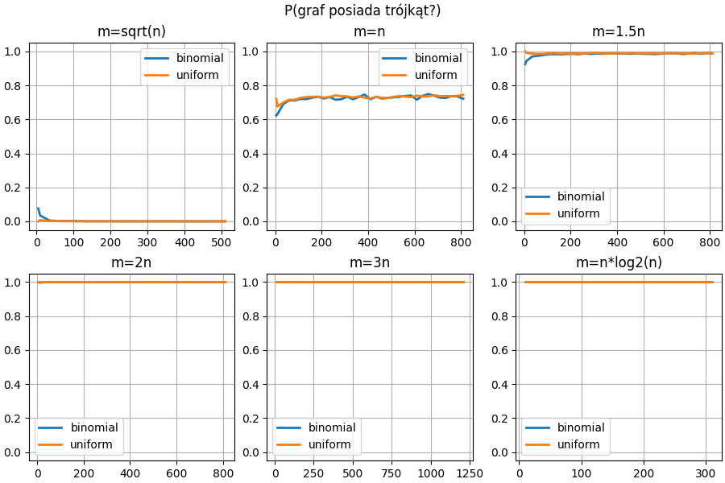
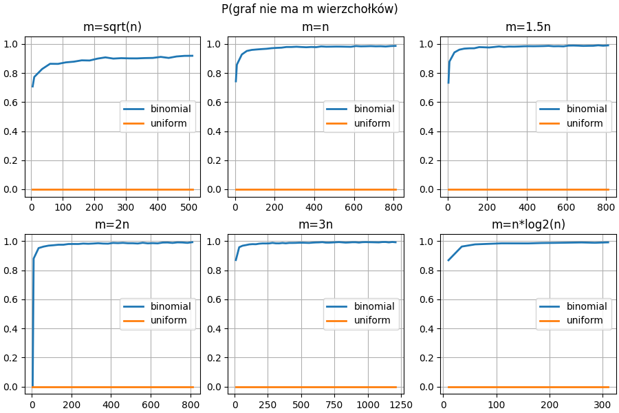

# Misja 1: Nothing Compares 2U

**Agent 1**: Mateusz Pełechety  
**Agent 2**: Jakub Sokołowski  

Niech $G_{n,p}$ będzie dwumianowym grafem losowym, zaś $G_{n,m}$ jednostajnym grafem losowym. Zdefiniujmy własności:
- $P_\Delta$: graf posiada co najmniej jeden trójkąt,
- $P_C$: graf jest spójny,
- $P_{=4}$: co najmniej połowa wierzchołków ma stopień równy 4,
- $P_{\neq m}$: liczba krawędzi w grafie jest różna od $m$.

Dla każdej z własności $P^*$, spróbuj sensownie na wykresach porównać $P[G_{n,p} \in P^*]$ z $P[G_{n,m} \in P^*]$ dla dostatecznie dużych $n$, $p = \frac{m}{\binom{n}{2}}$ oraz $m$ takiego, że $m = m(n)$, gdy $n \to \infty$, ale $\binom{n}{2} - m(n) \to \infty$.

Czy dla którejś z powyższych własności którakolwiek z poniższych nierówności ma szansę być spełniona przy tak wybranych $p$ oraz $m$?
1. $P[G_{n,m} \in P^*] \leq 2 P[G_{n,p} \in P^*]$
2. $P[G_{n,m} \in P^*] \leq 3 \sqrt{m} P[G_{n,p} \in P^*]$
3. $P[G_{n,p} \in P^*] \leq P[G_{n,m} \in P^*]$

# $P_\Delta$: graf posiada co najmniej jeden trójkąt

# $P_C$: graf jest spójny

# $P_{=4}$: co najmniej połowa wierzchołków ma stopień równy 4

# $P_{\neq m}$: liczba krawędzi w grafie jest różna od $m$
